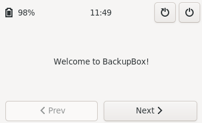
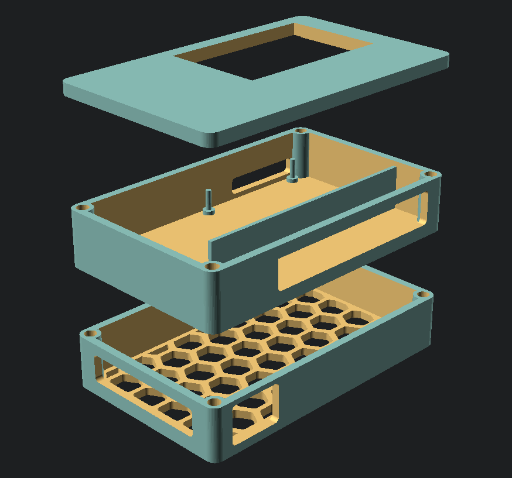

# Backup Box

A portable device to backup your daily pictures from an SD card to a portable drive. 

## Motivation & Scope

> Every time I go on vacation with my girlfriend, she asks me to backup all the picture she has taken with her camera to my laptop "just to be safe".
> I figured I could put together a small portable device that is able to automatically backup new pictures in a few simple steps, and spare my laptop the daily torture.

The whole thing needs to be:

- **Simple**:
    it needs to do one thing, and has to do it well, while adhering to the [workflow][#workflow].
    No useless customization or options.
    Hopefully it should be straightforward to use even for someone with limited technical skills;

- **Portable and compact**: 
    it needs to be small enough so we can toss it in our bag and forget about it.
    Also it should be a single object, and not a bunch of components to be put together every time.
    No additional input device other than a touch screen should be required;

- **Incremental**:
    Backup should be incremental and duplicate backups should be avoided;

## Details

### Workflow

The entire project is built around the following workflow.
Since the final product needs to be **simple**, the entire backup process should be straightforward.
Options, customization and branches in the workflow have been avoided as much as possible.

1. Power on the RPi
1. Connect external microSD card
1. Start backup from the welcome screen
1. Select device to backup
1. Select the destination of the backup
1. Start the backup
1. Power off the RPi when the process is complete
1. Remove external microSD card

The requirements might change with time and use, and as a consequence the workflow might change as well.

### Main board and touchscreen

A [Raspberry Pi 3 Model B] is used for the build.
This turned out to be more than enough.

A 3.5" 320x480 [touchscreen] is used as input, configured according to the [wiki guide].

### Storage system

In this case a [mini thumb drive] (~128GB) should be enough.

### Custom software GUI

The custom software interface is written in Rust using the [`gtk-rs` library][gtk-rs].
The design was partially created using [Glade].

  

After a limited number of attempts it seems like the RPi3 is not able to compile the project (especially the compilation of `gtk-rs` seems to take hours and then freeze the board completely).

The easiest way to compile the project is using Rust cross compilation tool [`cross`][cross].

*Further details on how to compile the project, along with precompiled binaries, will be published later on.*

### Powering the RPi3

Ideally the RPi3 can be powered with a [suitable powerbank].
The prototype is being tested with a [2000000mAh powerbank] capable of outputting 5V/3A.

An alternative route is to use a Li-Po battery attached directly to the RPi.
While this solution might be more compact, a generic powerbank can be detached from the build and used to charge other devices as well.

### Custom enclosure

I'm working on a simple prototype for a custom 3D printed enclosure to hold the RPi3, touchscreen, powerbank and SD card reader.
The design was developed with [OpenSCAD] and is as parametrized as possible to allow variations is the size of the different components.

Here is an early prototype for the case:

  

## Skills learned so far

- [X] Rust [interior mutability] pattern for shared ownership with mutability constraints checked at runtime;
- [X] Rust cross compilation via `cross`[cross];
- [X] Basics of GTK 3 and `gtk-rs` library for Rust;
- [X] OpenSCAD design beyond the tutorial.

## Acknowledgements

*todo*

[Raspberry Pi 3 Model B]: https://www.raspberrypi.org/products/raspberry-pi-3-model-b/
[touchscreen]: https://thepihut.com/products/spi-3-5-320x480-touch-screen-gpio
[wiki guide]: https://www.waveshare.com/wiki/3.5inch_RPi_LCD_(A)
[mini thumb drive]: https://www.ebay.co.uk/itm/353470846385
[gtk-rs]: https://gtk-rs.org/
[Glade]: https://wiki.gnome.org/Apps/Glade
[rustup ram issue]: https://github.com/rust-lang/rustup/issues/2128
[suitable powerbank]: https://www.reddit.com/r/raspberry_pi/comments/fvfn4w/raspberry_pi_powered_from_a_powerbank_part_two/
[2000000mAh powerbank]: https://www.ebay.co.uk/itm/223949142966
[OpenSCAD]: https://openscad.org/ 
[interior mutability]: https://doc.rust-lang.org/beta/book/ch15-05-interior-mutability.html
[cross]: https://github.com/rust-embedded/cross 
